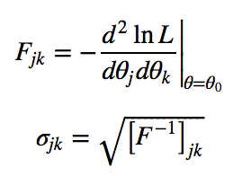

# Text Errata

A List of errors and typos in the book
[Statistics, Data Mining, and Machine Learning in Astronomy](http://press.princeton.edu/titles/10159.html)

There are a couple ways to submit a new error report

- If you are a GitHub user, you can open a [Pull Request](https://help.github.com/articles/using-pull-requests) which edits this document.
- If you are not a GitHub user, please email the authors directly with your reported error, and we will add it to the list.

# Errata

Errors are listed by chapter, followed by page number.

## Chapter 1

Page 19 (also, Figure 1.2 on Page 21): The function `fetch_sdss_spectrum()`
does not, in fact, query any database in real time.  It simply retrieves a
specific file from the SDSS-I/II Data Archive Server (DAS) via http.

Page 20: below In[5], "plate" should be commented out

Page 35: Figure 1.13 is incorrectly labeled a Mercator projection.  It's actually an Equirectangular projection (also known in WCS as a "Cartesian projection")

## Chapter 2

Page 47/50: there are eight entries despite the title "Seven Strategies..."

Page 55: ``vectorized_nn`` and ``easy_nn`` do not return the same distances: the ``vectorized_nn`` function is missing a square-root.

Page 60: Eq. (2.7), "less than" sign should be "greater than".

## Chapter 3

Page 75: "If the patient is healthy (T = 0)..." should be "If the patient is healthy (D = 0)...".

Page 75: "If the patient has the disease (T = 1)..." should be "If the patient has the disease (D = 1)...".

Page 95: in the Python code preamble 'is implemented in "scipy.stats.cauchy"' should be replaced with "scipy.stats.laplace".

Page 99: The line below Eq. (3.60) should say "Note that for k = 1 this distribution is a Cauchy distribution", not "k = 2".

Page 104: Figure 3.19 shows the positive part of a double Weibull distribution, not a Weibull distribution. In this case it means that the values on the y axis are half of what they should be. To get a Weibull distribution in scipy, use exponweib with a=1 rather than dweibull. 

Page 109: The first sentence in the paragraph preceeding Eq. (3.78) should read
"If sigma_xy=0, then x and y are uncorrelated, and if also independent, we can
treat them separately as two one-dimensional distributions." (that is, vanishing
correlation does not necessarily imply independence).

## Chapter 4

Page 126: The denominator of the argument of the exponential of Eq. (4.2) should be sigma squared, not sigma, to better match Eq. (3.43) and lead to Eq. (4.4).

Page 128: Equation 4.6 is not correct: the confidence limits are related to the inverse of the *matrix*, not the inverse of the *elements* of the matrix. The correct expression is as follows:

Page 130: The denominator of the argument of the exponential of Eq. (4.11) should be sigma squared, not sigma, to better match Eq. (3.43) and lead to Eq. (4.13).

Page 134: Typo: Aikake should be Akaike

Page 143: The pointers "upper panel" and "lower" panel in the caption for Figure 4.4, and below in text, should be "left panel" and "right panel".

page 167: The `x` value in figure 4.8 behaves like a magnitude (i.e. large x is selected out for large distances y); the text on the page implies it can be considered as a luminosity.

## Chapter 5
Page 182-183: The terms in both parentheticals of Equation (5.14) should be swapped (e.g. 1-sum(p_{i}) should read sum(p_{i})-1, and similar for the mu term. Then Equation (5.16) should read -[ln(p_{i}/m_{i}) + 1] + lambda_{0} + i*lambda_{1} = 0, and Equation (5.17) becomes p_{i} = m_{i}*exp(-1 + lambda_{0})*exp(i*lambda_{1}). 

Page 183: In Equation (5.17), the argument for the last exp is missing a minus sign.

Page 188: In Equation (5.27) the labels of M should be swapped.  The correct
equation is O_{21} = p(D|M_2)/p(D|M_1).

Page 201: In Equation (5.61), the lower integration limit should be minus infinity, not 0.

Page 202: Typo: Aikake should be Akaike

Page 221: In the sentence immediately preceding Eq. (5.100) the words 'and mu' should not be there.

Page 225: In Equation (5.106) there should be 8.09 in the denominator instead of 9.09 (from Eq. 5.105). Also, the result can be rounded to 1.46 (because it is actually 1.45859).

Page 225: In Equation (5.107) there is an erroneous repeated end parenthesis on the left hand side of the equation.

Page 234: In the sample Python code, the sigma in the pymc.Normal command should be replaced with 1./sigma**2.

Page 247: Typo: Aikake should be Akaike

## Chapter 6

Page 254: Equation 6.5 is a log likelihood function and should be maximized rather than minimized (which is what the text suggests). Alternatively, if a negative sign is inserted into the equation it describes the negative log likelihood and should be minimized.  

## Chapter 7

Page 309: In the gray box, the simulated data uses 1000 points in 2 dimensions, but the comments refer to 100 points in two dimensions.

## Chapter 8

Page 323: The y label in the bottom four panels in fig. 8.1 should be theta_0, and not theta_2.

Page 326: Eq. 8.7 should start: "ln(L) \equiv ln(p(\theta|{x_i,y_i},I)) \propto \sum ...", i.e. the p inside ln is missing.

Page 328: Text reads "This is reflected in in the $\chi^2_{dof}$  for this fit  which is 1.54 ...", while the corresponding upper left panel of Figure 8.2 (on same page) says $\chi^2_{dof} = 1.57$.

Page 329: The in-line comment on line 3 of the code snippet (the line begins with: X = np.random...) spills over to the next line and does not look like a comment anymore.

Page 329: The last line of the preamble to the code box, "For data with *homoscedastic* errors..." should say *heteroscedastic* errors.

Page 331: Line 3 in the code snippet is all a comment: "# dimension  dy = 0.1". The part "dy = 0.1" must be an instruction instead.

Page 332: Eq. 8.29 is missing the C^{−1} term between the two terms in parenthesis.

Page 336: The caption of the code snippet reads "Ridge regression can be accomplished with the Lasso class in Skikit-learn:" This should be instead "Lasso regression can be accomplished ..."

Page 339: Typo on line 7, "that" should be replaced by "than" in the sentence
"...the bandwidth is more important that the exact shape..."

Page 357: In Equation 8.77 and 8.78, the term in square brackets should be squared.

## Chapter 9

Page 372: Equation 9.21 is missing a logarithm term. We should replace ``2\pi(\sigma_i^k)^2`` with ``\ln [ 2\pi(\sigma_i^k)^2 ]``

Page 375: Equation 9.25 second term on the right is missing \mu_k after \sigma^{-1}

## Chapter 10
Page 419: Equation 10.18 is missing the $dt$. It should read $H_w(t_0; f_0, Q) = \int_{-\infty}^{\infty} h(t) w(t | t_0, f_0, Q) dt$.
Page 427: in the first paragraph of section 10.3.1, it should be
         omega = 2 pi f = 2 pi / P, and not (2 pi P) for the last part.

Page 433: numerical term in text just before eq.10.57, immediately after the text 
"...the first term becomes..." should read N*(A/σ)^2/2 (that is, an extra N). 

Page 437: figure 10.16: in the creation of this figure, the noise was not applied
to the data before computing the periodogram.  See a more detailed discussion along
with an updated figure on the
[astroML website](http://www.astroml.org/book_figures/chapter10/fig_LS_sg_comparison.html)

Page 444: Eqn 10.76: $\atan(b, a)$ should be replaced with $\tan^{-1}(b_m / a_m)$.

## Appendix

### Appendix A

### Appendix B

### Appendix C

Page 517:  The final paragraph of section C.3 should mention that SDSS does not
use Pogson magnitudes as defined in Equation C.2, but rather the asinh
magnitudes, see http://www.sdss3.org/dr10/algorithms/magnitudes.php#asinh.

Page 517: The SDSS magnitude system deviates from a perfect AB system by 0.01-0.02 mags.
See http://www.sdss3.org/dr10/algorithms/fluxcal.php#SDSStoAB.

### Appendix D

Page 519: This query has to be submitted within a particular context within CasJobs,
specifically DR8 or higher (DR7 does not have the value-added spectral information).

Page 519: The astrometric corrections of DR9 have not been applied to this query.
This affects the columns `G.ra` and `G.dec`. An additional join on the
`AstromDR9` table is necessary to get the correct astrometry (errors are <0.5 arcsec).
See also http://www.sdss3.org/dr10/imaging/caveats.php#astrometry.

Page 519: The URL in the footnote is incorrect and it should be
http://skyserver.sdss3.org/casjobs/ (only the SDSS-III CasJobs site contains DR8 and higher
data).

### Appendix E

### Index

Page 537: For entry MAP, a reference to page 179 should also be listed because MAP
is defined at that page (see bullet 4).
